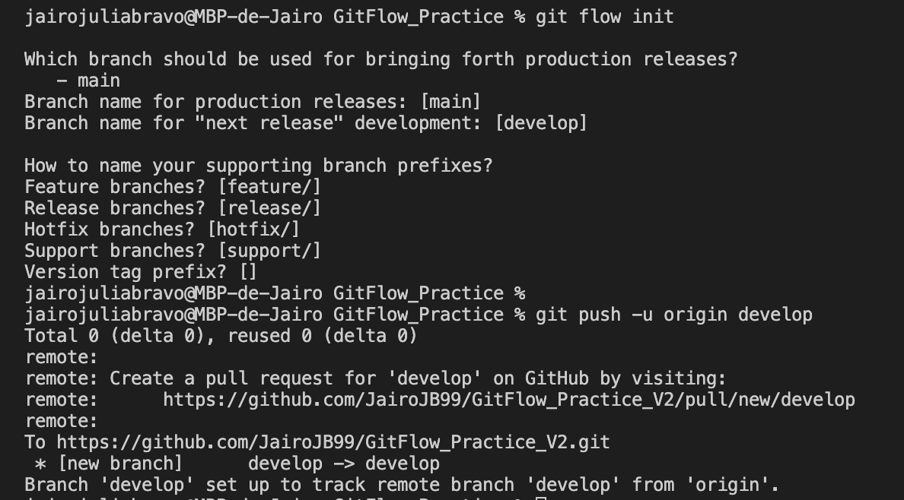

# Práctica GitFlow

## Que es Git y GitFlow?
Git es un software de control de versiones diseñado por Linus Torvalds, pensando en la eficiencia y la confiabilidad del mantenimiento de versiones de aplicaciones cuando éstas tienen un gran número de archivos de código fuente y Git-flow es un conjunto de extensiones para Git, basado en el modelo de ramificaciones de Vincent Driessen, que nos facilita el trabajo con nuestros repositorios.


## Tipos de ramas

- **main**:contiene un estado listo para producción.
- **develop**: contiene los últimos cambios a implentar en la próxima versión del software.

Auxiliares:
- **Feature**: Para nuevas características, nuevos requisitos o nuevas historias de usuario.
- **Release** Para estandarizar o cortar una serie de código que ha estado desarrollándose en la rama Develop, se saca una rama de este tipo, se mergea y ahí se depura.
- **Hotfix** Habitualmente se utiliza para código para depurar el código que venga de producción, por haberse detectado un defecto crítico en producción que deba resolverse, al que se le va a hacer una Release puntual para corregirlo.

## Documentación de la práctica

## Usuario 1

### Inicializar Proyecto
Primeramente utilizaremos los comandos proporcionados por GitHUb para inizializar el repositorio: 
```
echo "# nombre" >> README.md
git init
git add README.md
git commit -m "first commit"
git branch -M master
git remote add origin https://github.com/JairoJB99/nombrePractica.git
git push -u origin master
```

Si no tenemos instalado Git flow deberemos utilizar el comando:

```
sudo apt-get install git-flow
```

Una vez hemos realizado los pasos anteriores, ejecutaremos el comando **```git flow init```** para trabajar con esta extensión y pondremos el nombre por defecto de todas las ramas, aun que podemos personalizarlos y finalmente subimos los cambios a la rama develop para que todo el equipo tenga los cambios.



### Estructura Inicial

El usuario 1 debe crear la estructura inicial del proyecto y creará una rama feature que posteriormente se fusionará con la rama develop y posteriormente crear la primera versión del proyecto.

Creamos la nueva feture con el siguiente comando:

```
git flow feature start nombre
```

Una vez creados los ficheros (estructura inicial del proyecto) deberemos acutalizar los cambios en local con el comando **git add .**, hacer un commit con el comando **git commit -m "nombre"** y finalmente actualizar los cambios en nnuestra rama feature con el comando **git push origin nombre**.


Para finalizar deberemos juntar la release con la rama develop con los comandos:

```
git checkout develop
git flow feature finish nombre
git push -u origin develop
```


### Primera versión del proyecto (release)

Ahora crearemos una rama release para lanzar la version 1 con el comando:

```
git flow release start v1.0.0
```


Con el siguiente comando subimos los cambios a remoto en la rama release:
```
git push origin release/v1.0.0 
````

Finalmente después de las debidas pruebas fusionaremos la rama release con la main para así tenerla en producción con los siguientes comandos:

```
git flow release finish nombre_release
git push -u origin master
```

## Usuario 2
Ahora con el usuario dos clonaremos el repositorio y iniciaremos el comando git flow init para utilizar git flow.

```
git clone https://github.com/JairoJB99/GitFlow_Practice_V2.git usuario2
git flow init
```

Creamos una nueva feature

```
git flow feature start contenidoHTML
```


Posteriormente relizaremos los cmabios pertinentes  y finalizaremos la feature haciendo un merge a develop con los siguientes comandos:

```
git checkout develop
git flow feature finish contenidoHTML
git push -u origin develop
```


Ahora ya tenemos los cambios en develop y realizaremos los mismos pasos para crear la nueva feature AtributosHTML.


Subimos los cambios a la rama develop con los comandos:

```
git checkout develop
git flow feature finish atributosHTML
git push -u origin develop
```


Ahora deberemos crear la release con estas dos nuevas funcionalidades y posteriormente subir los cmabios a la rama principal para ponerlos en porducción.

Creamos la release:

```
git flow release start v1.1.0
```

Y ahora finalizamos la rama haciendo un merge a la rama main


## Usuario 3
En este usuario realizaremos el mismo proceso de clonación del proyecto y realizaremos las nuevas funcionalidades, esta vez la feature tendrá el nombre de **estilosCCS**.


Cuando relialicemos los pasos anteriores deberemos hacer un merge con la rama develop.


Como en los otros usuarios crearemos la rama release para poder subir los cambios a main.


## Usuario 1 (HotFix)
Por último el usuario 1 creara una rama hotfix para arreglar un bug con el comando **git flow hotfix start "nombre"** y una vez arreglado el fallo, ejecutará el comando **git checkout main** para cambiar a la rama principal,actualizar los cambios con **git add .** y **git commit - m "nombre"** i finalmente git flow hotfix finish "nombre" para cerrar la rama.


